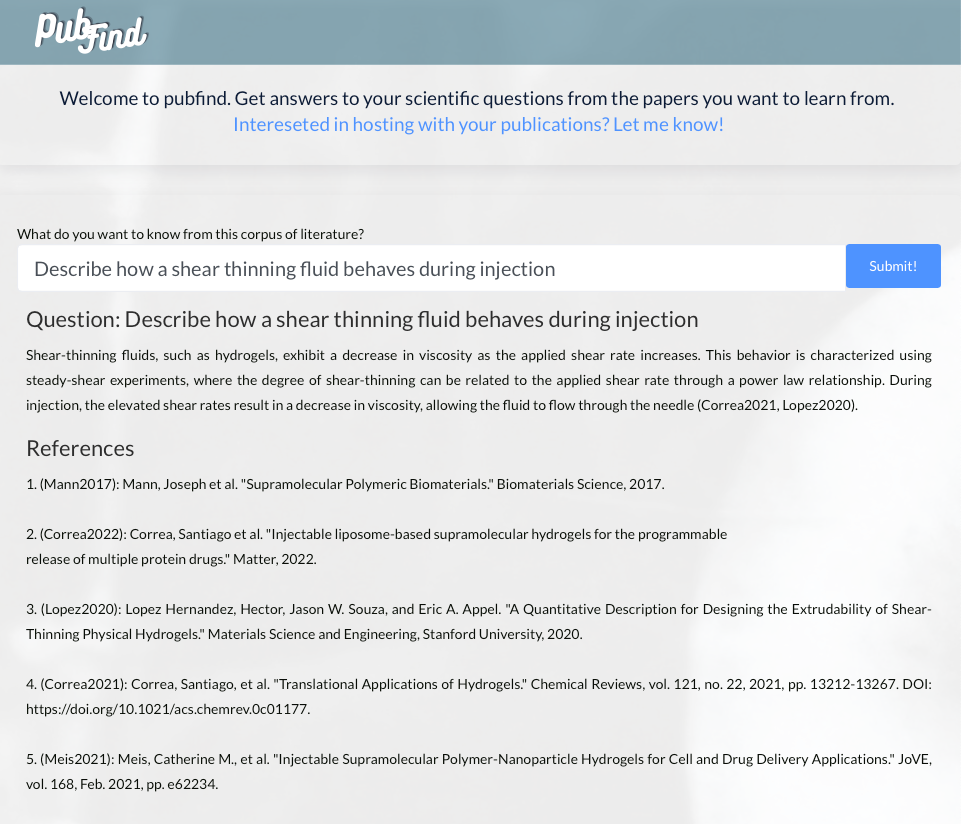

# PubFind

Pubfind is an application built to help researchers speed up the literature review process. It enables you to quickly ask 
a question from a set of articles and quickly retrieve relevant citations and a short answer, if possible. It is best used 
for focused literature reviews where the intent is to 1) identify key papers in a text corpus and 2) to enable succint answers to your research questions from the articles.

Pubfind is designed with the literature review process in mind. It allows you to create and maintain search indices for directories, allowing you to query different subsets of the literature. Just create a directory with pdfs and citations, create your search index, and ask away.

Example answer for a query made on a corpus of 105 scientific articles from my postdoctoral lab (www.supramolecularbiomaterials.com)
<p align="center">

</p>

## Setup
To set up, you must create a **study_directory** for your set of papers. In the study_directory create a **pdfs** 
directory that contains pdf articles. Before you can start perusing the scientific articles you must first provide citations for each file. You can supply them yourself or use the ```get_citations_for_files.py```
to attempt automatic citation retrieval. The JSON must have filenames as keys and the citation as values.
```
citations = {path: citation}
e.g.
citations = {"file1.pdf": "Last, First, et al. \"Title.\" Journal, 2023"}
```
After collecting the pdfs and citations, your directory should be the following.

```
│-pub_find
│   |-study_directory  
│       ├- citations.json   
│       ├- pdfs  
│           ├-file1.pdf  
│           ├-file2.pdf   
```
## Run App
The app can be run via the recommend Flask App.

```flask run```

It can also be run via the command line (run.py). Modify the question in run.py to your needs.    

```python main.py```

Running the app will automatically:  
1. scan the target directory for new/deleted pdf files  
2. embed pdf documents that are not already embedded (use a gpu if possible)
   3. the embeddings do NOT have to be created using this script. If you'd like to embed in colab or other location, repurpose the embed_files function from src.main and add the pickled embeddings to the embeddings' directory.
3. load/initialize a search index
4. allow you to do question-answer

### Final directory structure
```
│-pub_find
│   |-study_directory
│       ├- docs  # pickled object for search
│       ├- index # pickled FAISS vectorstore  
│       ├- citations.json   
│       ├- pdfs  
│           ├-file1.pdf  
│           ├-file2.pdf
│       ├- embeddings  
│           ├-file1.pkl
│           ├-file2.pkl
 
```
If you add or delete pdf files, rerun the app to update the search index. Make sure to add the new citations to the citation.json document before rerunning the app.

## Under the hood
### Embeddings
Pubfind uses open source Instructor-XL embeddings to embed the scientific articles. Articles can be lengthy and the cost for embedding 100 scientific pdfs can exceed $400 USD when using the OpenAI ada-002 embeddings. This is simply too much cost to embed a text corpus for a literature review, where the articles may or may not be relevant to your final search. Work is still needed to benchmark the performance of these embeddings vs ada-002 embeddings.

### Document QA
Pubfind leverages the ```paper-qa``` repository to create a searchable index and handle the query process. It was modified in this repository to allow for the creation of the FAISS vectorstore from embeddings. This allows us to decouple the embedding process from the creation of the Docs class.

### Prompt Engineering
For scientific reviews, it is critical that hallucinations are kept to a minimum. Pubfinds goal is to highlight relevant articles and to provide answers only when they are supported by the text. By engineering the LLMs to respond in a scholarly tone and to only answer when confident in an answer, an answer is only provided when sufficient evidence is found in the text. The compromise here is that the LLM leans towards not providing an answer, even when there is some evidence in the source material. The output LLM in this repo has been truncated to provided answers only 50 words in length, minimizing the verboseness of the output.

### Directory Management
The literature review process involves the collection and analysis of papers in target domains or research niches. Pubfind should help researchers contain each part of their lit review process, including creating unique directories for each target domain and ease of adding and removing articles from their search index.
